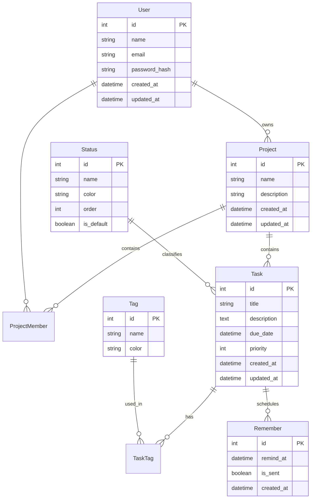

```mermaid
  erDiagram
      User {
          int id PK
          string name
          string email
          string password_hash
          datetime created_at
          datetime updated_at
      }
  
      Project {
          int id PK
          string name
          string description
          datetime created_at
          datetime updated_at
      }
  
      ProjectMember {
      }
  
      Status {
          int id PK
          string name
          string color
          int order
          boolean is_default
      }
  
      Tag {
          int id PK
          string name
          string color
      }
  
      Task {
          int id PK
          string title
          text description
          datetime due_date
          int priority
          datetime created_at
          datetime updated_at
      }
  
      TaskTag {
      }
  
      Remember {
          int id PK
          datetime remind_at
          boolean is_sent
          datetime created_at
      }
  
      User ||--o{ Project : owns
      Project ||--o{ ProjectMember : contains
      User ||--o{ ProjectMember : ""    
      Project ||--o{ Task : contains
      Status ||--o{ Task : classifies
      Task ||--o{ TaskTag : has
      Tag ||--o{ TaskTag : used_in
      Task ||--o{ Remember : schedules
```
